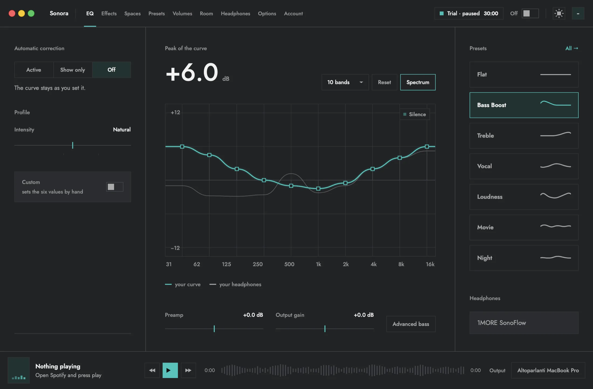

### Sonora

A system equalizer for macOS. It sits in the menu bar and shapes the sound of
the whole Mac, not one app at a time: ten bands or more, bass on its own page,
25 effects, 13 space scenes, room correction, and an AI assistant that can only
touch the sound.

**[eqsonora.com](https://eqsonora.com)** · [Download for macOS](https://eqsonora.com/download) · [Pricing](https://eqsonora.com/pricing)

The app is free everywhere. The source code is private, but the conversation is
open: **[share an idea, ask a question or say what you think](https://github.com/eqsonora/sonora-app/discussions)**,
and read how Sonora works in the **[sonora-app](https://github.com/eqsonora/sonora-app)** repository.
